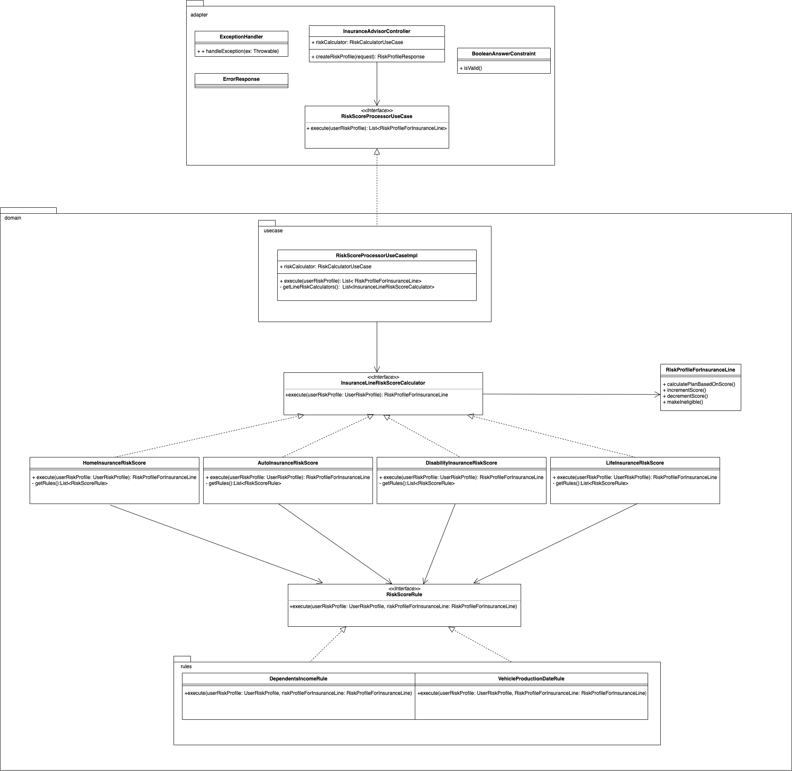

# insurance-advisor-service
Service responsible for generating a customized insurance profile for users' specific needs according to their entries.

## Main Architectural Components

- [**Adapter**](./src/main/kotlin/com/dls/insuranceadvisorservice/adapter): Responsible to expose a REST API POST endpoint /insurance/advisor.
- [**UseCase**](./src/main/kotlin/com/dls/insuranceadvisorservice/domain/usecase): This use case provide an implementation for accessing the domain logic responsible to calculate a risk profile for each line of insurance.
- [**InsuranceLines**](./src/main/kotlin/com/dls/insuranceadvisorservice/domain/insurancelines): Responsible to calculate a risk profile for each line of insurance.
- [**Rules**](./src/main/kotlin/com/dls/insuranceadvisorservice/domain/insurancelines/rules): Contains all rules that can be used to calculate risk score.
- [**Domain**](./src/main/kotlin/com/dls/insuranceadvisorservice/domain): The [**RiskProfileForInsuranceLine**](./src/main/kotlin/com/dls/insuranceadvisorservice/domain/RiskProfileForInsuranceLine.kt) It's a risk profile for any line of insurance. It suggest a plan ("economical", "regular", "responsible") based on the user's risk score.

## Code Design Strategy
The following strategies were used to have an understandable, extensible and maintainable code:
- The [**adapter**](./src/main/kotlin/com/dls/insuranceadvisorservice/adapter) layer is a gateway for a user or any program else to interact with the application. There's no domain logic here.
- It's possible to create new [**rules**](./src/main/kotlin/com/dls/insuranceadvisorservice/domain/insurancelines/rules) easily, just by implementing the [**RiskScoreRule**](./src/main/kotlin/com/dls/insuranceadvisorservice/domain/insurancelines/RiskScoreRule.kt) interface. After that, it can be used in [**any line of insurance**](./src/main/kotlin/com/dls/insuranceadvisorservice/domain/insurancelines).
- It's possible to create new lines of insurance risk score calculator easily, just by implementing the [**InsuranceLineRiskScoreCalculator**](./src/main/kotlin/com/dls/insuranceadvisorservice/domain/usecase/InsuranceLineRiskScoreCalculator.kt) interface. After that, you need to add the newline in the [**use case orchestration**](./src/main/kotlin/com/dls/insuranceadvisorservice/domain/usecase/RiskScoreProcessorUseCaseImpl.kt).



## Tech Stack 
- **Language**: Kotlin
- **JDK**: Java 11
- **Framework**: SpringBoot
- **Dependency Management**: Gradle

## Run the code
It's possible to build and run the application using docker with the following commands:
```
docker-compose up
```
Or we can just build it and run the jar file:
```
 ./gradlew build
 java -jar build/libs/insurance-advisor-service-0.0.1-SNAPSHOT.jar
```
## Test
 [**postman collection**](./InsuranceAdvisor.postman_collection.json)
```
curl --location --request POST 'localhost:8080/insurance/advisor' \
--header 'Content-Type: application/json' \
--data-raw '{
"age": 35,
"dependents": 2,
"house": {"ownership_status": "owned"},
"income": 0,
"marital_status": "married",
"risk_questions": [0, 1, 0],
"vehicle": {"year": 2018}
}'
```
Response example:
```json
{
    "auto": "regular",
    "disability": "ineligible",
    "home": "economic",
    "life": "regular"
}


```
The swagger documentation can be accessed at http://localhost:8080/swagger-ui/index.html#
